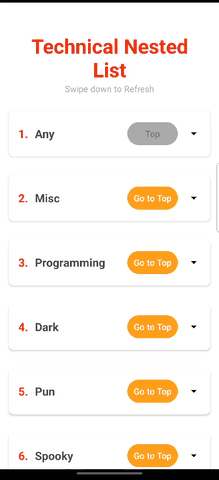

# Technical Nested List - Kotlin

- Clean MVVM Architecture.
- Dependency Injection with Dagger & Hilt.
- Modularization.
- Jokes Caching with Room.
- Flow & Coroutines.
- Fallback to other category when the corresponding category has no jokes.
- Shimmer Loading.

## Preview
|  | 
| :---:                              | 
|   |

